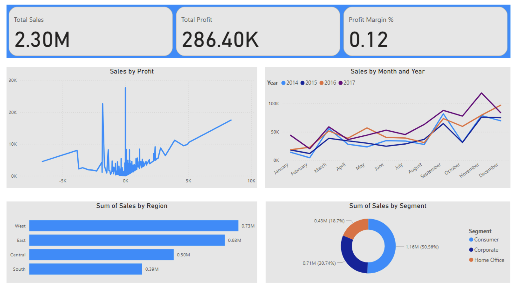

# Superstore-PowerBI-Project
# 📊 Superstore Sales Analysis - Power BI Project

## 🔍 Overview

This project analyzes sales, profit, and operational data for a Superstore business using Power BI. It helps uncover business insights through dynamic dashboards covering sales trends, product performance, customer segmentation, and shipping operations.

---

## 📁 Dataset

**Source:** Internal  
**File:** `super-store-data.xlsx`  
**Sheet:** `Orders`

| Column Name      | Description                      |
|------------------|----------------------------------|
| Order ID         | Unique identifier for orders    |
| Order Date       | Date when order was placed      |
| Ship Date        | Date when order was shipped     |
| Ship Mode        | Shipping method used            |
| Customer Name    | Customer full name              |
| Segment          | Customer segment classification |
| Region           | Sales region                    |
| Product Name     | Name of the product             |
| Category         | Product category                |
| Sub-Category     | Sub-category of products        |
| Sales            | Total sale amount               |
| Profit           | Profit earned on the sale       |
| Discount         | Discount applied                |
| Quantity         | Quantity sold                   |

---

## 🎯 Key KPIs

- Total Sales
- Total Profit
- Profit Margin (%)
- Total Orders
- Total Customers
- Average Sales & Profit per Order
- Sales by Region, Category, and Customer Segment
- Top Performing Products & Customers
- Shipping Mode Analysis
- Monthly Sales & Profit Trends

---

## 📊 Power BI Dashboards

### 1️⃣ Executive Summary
- Total Sales, Profit, and Margin
- Sales & Profit trends
- Sales by Region and Segment
- Top 5 Products and Customers

### 2️⃣ Product & Customer Insights
- Sales by Category/Sub-Category
- Top 10 Products & Customers
- Profitability Matrix

### 3️⃣ Operations & Shipping
- Sales by Ship Mode
- Ship Mode performance by Region
- Order Processing Time

### 4️⃣ Time Analysis
- Monthly and Year-over-Year Sales & Profit trends

---

## ⚙️ Technologies

- Power BI Desktop
- DAX
- Data Modeling & Visualizations

---

## 🛠️ Setup & Usage

1. Download or clone this repository:
   ```bash
   git clone https://github.com/YourUsername/Superstore-PowerBI-Project.git
## 🖼️ Dashboard Preview

### Executive Summary



